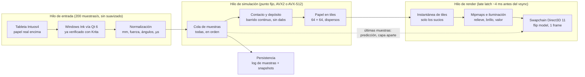

# Motor de medios secos — Plan de arquitectura

8 de octubre de 2026 · Daniel

> Documento de diseño. Todavía no hay código: este plan define la arquitectura y el orden de trabajo.

## Objetivo y criterios de éxito

La meta es que dibujar se *sienta* como lápiz sobre papel; que el resultado se parezca a un dibujo real es una consecuencia, no el objetivo. Es una app personal, nativa en Windows, optimizada para un único set de hardware.

1. **Latencia percibida**: el trazo acompaña la punta sin "perseguirla". Meta: menos de 40 ms de pen-to-photon medidos, contra los 60 a 100 ms típicos de Krita o Photoshop.
2. **Continuidad**: ningún artefacto de estampado (dabs) a ninguna velocidad de trazo.
3. **Papel con memoria**: la segunda pasada responde distinto que la primera (diente lleno, bruñido).
4. **Respuesta multivariable**: presión, inclinación, velocidad y orientación cambian la marca de forma creíble.
5. **Herramienta viva**: la punta se gasta y se afila.
6. **Interfaz ausente**: una hoja, una herramienta y la goma en el extremo del lápiz.
7. **Fuera de alcance**: capas, selección, transformaciones, filtros, exportación sofisticada, multiplataforma.

## Perfil de hardware

El cuello de botella no es el cómputo sino los monitores de 60 Hz: 16,7 ms por frame es el término de latencia más grande del sistema. La simulación de medios secos es local y barata, así que ambas máquinas sobran.

| Equipo | Datos | Implicancia para el diseño |
| --- | --- | --- |
| Wacom Intuos4 Large (PTK-840) | Área activa 325,1 × 203,2 mm; 2048 niveles de presión; activación < 1 g; inclinación ±60° con 2° de precisión; 200 puntos/s; precisión ±0,25 mm; 5080 lpi | 200 Hz = una muestra cada 5 ms, más de 3 por frame: hay que integrar todas, no solo la última. La precisión de ±0,25 mm (≈ 100 dpi) es el límite de exactitud posicional; más resolución sirve para el grano del papel, no para la posición |
| Rotación del lápiz | Solo la reporta el Art Pen (ZP-600), no el Grip Pen estándar | Tratar la rotación como entrada opcional; el diseño no debe depender de ella |
| Driver | Wacom declaró la 6.3.41 como versión final para Intuos4 (soporte oficial hasta Windows 10); en Windows 11 funciona en la práctica | Fijar la versión de driver que ande bien en ambas máquinas y no actualizarla. Windows Ink ya verificado sobre el driver actual en la laptop |
| Laptop MSI Modern, i7 11.ª gen | 4 núcleos / 8 hilos, AVX-512; GPU integrada (probablemente Iris Xe, a confirmar) | CPU fuerte para SIMD; GPU integrada suficiente para componer e iluminar el papel |
| Desktop | i5 Skylake 4 núcleos / 4 hilos (AVX2, sin AVX-512); GTX 960 4 GB; 16 GB RAM | CPU más débil, GPU dedicada más fuerte. El kernel de simulación debe tener ruta AVX2 además de AVX-512 |
| Monitores | Todos a 60 Hz; ultra-wide con la tableta mapeada a una porción | 16,7 ms por frame. Falta el tamaño físico del ultra-wide para el modo de escala 1:1 |
| Superficie | Hoja de papel real sobre la tableta | La fricción ya está resuelta en hardware. Además permite usar ese mismo papel como fuente del grano virtual (ver Render) |

Conclusión: diseño único para las dos máquinas, con el mismo comportamiento en ambas. Las diferencias de rendimiento se absorben en la ruta SIMD, no en la lógica.

## Presupuesto de latencia a 60 Hz

Con monitores de 60 Hz, la mayor ganancia está en no desperdiciar frames en la presentación, no en simular más rápido. Las cifras son estimaciones a validar en la Fase 0.

| Etapa | Típico en apps genéricas | Meta | Cómo |
| --- | --- | --- | --- |
| Muestreo de la tableta | 0–5 ms | 0–5 ms | Fijo por hardware (200 Hz) |
| USB, driver y API de entrada | 2–8 ms | 2–8 ms | Hilo de entrada dedicado; Windows Ink con historial completo de muestras |
| Espera hasta que la app procesa | 0–17 ms | ≈ 1 ms | Leer las muestras justo antes de renderizar (*late latch*) |
| Simulación y render del cambio | 2–10 ms | < 3 ms | Solo tiles tocados; sin recomponer el lienzo entero |
| Cola de presentación y DWM | 17–50 ms | 0–17 ms | Swapchain *flip model*, latencia máxima de 1 frame, objeto *waitable* |
| Scanout y respuesta del panel | 10–20 ms | 10–20 ms | Fijo por monitor |
| **Total pen-to-photon** | **≈ 60–100 ms** | **≈ 25–40 ms** | |

**Estrategias, en orden de aplicación**

1. **Flip model con 1 frame de latencia**: `DXGI_SWAP_EFFECT_FLIP_DISCARD`, `SetMaximumFrameLatency(1)` y esperar el objeto waitable antes de cada frame. Es la ganancia más grande y no tiene contras.
2. **Render justo a tiempo**: tras el waitable, dormir hasta unos 4 ms antes del vsync (ajustado por el tiempo de render medido), recién ahí leer las muestras nuevas, simular y presentar.
3. **Predicción corta de la punta**: extrapolar como máximo un frame y dibujarlo en una capa provisional que *nunca* se escribe al papel; el frame siguiente la reemplaza con datos reales. Atenuarla al desacelerar para evitar que se pase en los finales de trazo. Debe poder apagarse.
4. **Experimento con tearing**: con la ventana en pantalla completa sin bordes (el papel ocupa la zona mapeada y el resto queda neutro) y `ALLOW_TEARING`, se puede presentar en cuanto llegan muestras, sin esperar el vsync. Ahorra en promedio unos 8 ms; el tearing sobre un trazo fino de lápiz debería ser casi invisible, pero hay que verlo.

**Medición** (parte de la Fase 0, no opcional)

1. Interna: timestamp de cada paquete contra el momento de presentación real (estadísticas de frame de DXGI), registrado por trazo.
2. Externa: filmar lápiz y pantalla con el celular en cámara lenta (240 fps) y contar frames entre la punta y la marca.
3. Un overlay de depuración que muestre la latencia en vivo.

## Arquitectura general

Tres hilos con flujo en un solo sentido: entrada, simulación y render. La simulación consume todas las muestras en orden y es la única que escribe el papel; el render solo lee instantáneas.

La predicción toma las últimas muestras pero se dibuja en una capa aparte y nunca toca el papel; por eso el resultado es reproducible desde el log.

**Módulos**

1. `input`: lectura de la tableta y normalización a unidades físicas.
2. `drymedia` (biblioteca, sin dependencias de Qt ni de D3D): papel, herramientas, contacto, parámetros de medio.
3. `render`: swapchain, mipmaps, iluminación, capa de predicción.
4. `store`: log de muestras, snapshots, replay.
5. `app`: cascarón Qt mínimo, configuración y calibración.
6. `audio`: opcional, fase final.

## Pipeline de entrada

La entrada se lee en un hilo propio, se convierte de inmediato a unidades físicas y se encola con su timestamp; nada del resto del sistema ve eventos de Qt ni coordenadas de pantalla.

**Windows Ink (ya resuelto)**

1. Ya verificado en el proyecto Chiaro: con Krita en Windows Ink, la Intuos4 funcionó perfecto en la laptop, con presión e inclinación.
2. Decisión: Windows Ink, que es lo que Qt 6 usa por defecto y lo mismo que usa la familia de apps de ejercicios. Conviene reutilizar el adaptador de entrada de tableta de `paintcore` en lugar de escribir uno nuevo.
3. Detalle a validar: que Qt entregue todas las muestras (200 por segundo) y no solo una por mensaje. Si las agrupa, se lee el historial completo de cada mensaje (`GetPointerPenInfoHistory`).
4. Pendiente menor: confirmar lo mismo en la desktop, porque la prueba fue en la laptop.
5. Wintab queda solo como plan B (`-platform windows:nowmpointer`), sin código propio por ahora.

**Normalización de cada muestra**

| Campo | Unidad interna | Nota |
| --- | --- | --- |
| Posición | mm sobre la hoja virtual (coma flotante) | Mapeo tableta → hoja definido una sola vez, independiente de la pantalla |
| Presión | fuerza estimada 0–1, tras curva de calibración propia | Una curva medida con tu mano, no la del driver (dejar la del driver lineal) |
| Inclinación | azimut y altitud en grados | Derivados de tilt X/Y; precisión 2° |
| Rotación | grados, o ausente | Solo con Art Pen |
| Timestamp | µs, reloj monotónico | Del driver si es estable; si no, del momento de lectura |
| Velocidad y aceleración | mm/s, mm/s² | Calculadas con un filtro corto sobre posiciones con timestamp, sin suavizar la posición en sí |

**Reglas**

1. Ningún suavizado ni estabilizador de la posición. El único filtrado permitido es el de velocidad derivada.
2. Todas las muestras se procesan, nunca solo la última del frame.
3. Entre dos muestras, la marca se integra sobre el segmento completo (ver Simulación), así que 200 Hz alcanza aun en trazos rápidos.
4. Proximidad (lápiz en el aire) se registra para mostrar un cursor mínimo, nunca para dibujar.
5. El extremo goma del lápiz se detecta como herramienta distinta y cambia de herramienta sin interfaz.

## Modelo de simulación

La simulación corre en CPU, por tiles, en aritmética de punto fijo y con SIMD. El cambio por muestra es pequeño y local, así que no justifica la GPU, y en CPU el comportamiento es idéntico en las dos máquinas.

**Por qué CPU y no GPU**

1. La huella de contacto de un lápiz es de decenas de celdas por lado; incluso una barra de pastel de costado son unos pocos miles de celdas por muestra. Cabe sobrado en microsegundos con AVX2.
2. Evita idas y vueltas CPU↔GPU en el camino crítico de latencia; la GPU queda solo para presentar.
3. Punto fijo (enteros) da **determinismo exacto** entre la ruta AVX2 (desktop) y AVX-512 (laptop): el mismo trazo grabado produce el mismo papel en ambas. Es la base del replay (ver Persistencia).
4. Se revisa solo si el pastel con barra ancha excede el presupuesto de 3 ms por frame.

**Resolución y memoria**

1. 600 dpi (celda de unos 42 µm): suficiente para el grano del papel, que es lo que el ojo nota. La posición del lápiz es exacta solo a ±0,25 mm; el resto del detalle lo aporta el papel.
2. Una hoja A4 son unos 35 millones de celdas, en tiles de 64 × 64 (unos 8.600 tiles).
3. Tiles dispersos: solo existen en memoria los tiles tocados. El relieve base del papel es una textura de solo lectura compartida.
4. Con unos 10 bytes por celda en grafito, una hoja tocada entera son unos 350 MB; normal con 16 GB. El pastel suma canales de color.

**Estado por celda**

| Campo | Tipo | Para qué |
| --- | --- | --- |
| Relieve base del papel | u16, compartido | Diente original: crestas y valles |
| Deformación | u16 | Hundimiento plástico por presión (técnica de línea blanca) |
| Depósito ligado | u16 | Material adherido a la fibra |
| Depósito suelto | u16 | Polvo encima; casi cero en grafito, dominante en carbonilla |
| Bruñido | u8 | Aplastamiento y brillo; baja la adhesión de pasadas siguientes |
| Daño de fibra | u8 | Efecto del exceso de goma; aumenta la rugosidad |
| Color (fase pastel) | 3–4 × u16 | Masa de pigmento por canal en ligado y suelto |

**Herramienta**

1. La punta es un pequeño mapa de alturas en coordenadas locales (por ejemplo, 64 × 64 a resolución de simulación), orientado por la inclinación y la rotación.
2. Ese mapa **se gasta**: cada celda de la punta pierde material en proporción a lo que deposita. Las facetas aparecen solas, sin programarlas.
3. Afilar es reemplazar el mapa por una punta cónica nueva (un gesto o una tecla).
4. Cada medio es un archivo de parámetros recargable en caliente: dureza, tasa de depósito, fracción ligada contra suelta, movilidad, brillo y color.

**Contacto y depósito (el núcleo)**

1. Para cada muestra, se busca a qué profundidad entra la punta en la superficie (papel + depósito) de modo que la fuerza total de contacto iguale la presión aplicada. Con poca presión toca solo las crestas; con más, llega a los valles.
2. Entre dos muestras, la punta se **barre** sobre el segmento en subpasos de como mucho una celda, interpolando presión e inclinación.
3. El depósito por celda es proporcional a fuerza local × distancia deslizada × blandura de la mina × (1 − saturación). Como es proporcional a la distancia, el resultado no depende de cuántos subpasos se usen: esa es la diferencia de fondo con el estampado por dabs.
4. El bruñido crece con fuerza × deslizamiento sobre zonas con depósito, aplana crestas y reduce la adhesión futura.
5. La deformación aparece cuando la presión local supera un umbral del papel.
6. Goma: quita casi todo el suelto, una fracción del ligado según el tipo de goma, y suma daño de fibra.
7. Difumino (fases posteriores): mueve sobre todo el material suelto en la dirección del trazo y empuja material hacia los valles.

**Hilos**

1. El hilo de simulación consume la cola de muestras y marca tiles sucios.
2. El render toma una instantánea de los tiles sucios (versionado por tile), sin bloquear la simulación.

## Render y escala física

El área activa de la tableta (325,1 × 203,2 mm) es casi una hoja A4 apaisada (297 × 210 mm): la hoja real que va encima puede *ser* la hoja virtual, a escala 1:1.

**Hoja = tableta**

1. Windows Ink entrega la posición en la zona de pantalla a la que el driver mapea la tableta; la app la convierte a milímetros de la hoja conociendo esa zona y el área activa, así que el dibujo no depende de dónde se muestre la hoja.
2. Formato por defecto: A4 apaisado recortado a la altura útil (≈ 297 × 203 mm), o A5 completo con margen.
3. Se pueden marcar los bordes en el papel físico para que coincidan con los de la hoja virtual.
4. Rotar la hoja (con la otra mano o una tecla) rota el papel virtual bajo la tableta, igual que girar una hoja real.

**Pantalla**

1. Ventana a pantalla completa sin bordes en el ultra-wide; la hoja ocupa una zona del tamaño físico de la tableta y el resto queda neutro y oscuro.
2. Modo 1:1: la hoja se muestra al mismo tamaño físico que la tableta, con la escala calibrada una vez con una regla sobre el monitor. Falta el tamaño físico del ultra-wide para estimar la resolución resultante.
3. A unos 110 ppi de pantalla, cada píxel representa unas 5 × 5 celdas de simulación: se mantiene una pirámide de mipmaps por tile, actualizada solo en los tiles sucios.
4. Zoom de inspección disponible, pero como vista ocasional, no como forma de trabajo.

**Iluminación del papel**

1. Normal por celda derivada de relieve + deformación + depósito. Una luz direccional fija respecto del escritorio, como una lámpara.
2. Grafito: componente especular que crece con depósito y bruñido. Al rotar la hoja, el brillo cambia como en la realidad.
3. Carbón, carbonilla y pastel: mate, sin especular.
4. Valor tonal: el papel se ve con su albedo; el grafito y el carbón oscurecen según la masa depositada con saturación; el pastel compone por cobertura y opacidad.

**Pila gráfica**

1. Qt 6 solo como cascarón de ventana y entrada; el lienzo es un HWND hijo nativo con swapchain Direct3D 11 propio, para controlar flip model, latencia máxima, waitable y tearing sin depender de lo que exponga Qt.
2. Direct3D 11 funciona en la GTX 960 y en la GPU integrada de la laptop, y es la API con el control de presentación más maduro en Windows.
3. Subida a GPU solo de tiles sucios (64 × 64, pocos KB cada uno).

**Grano del papel a partir del papel real**

1. Fotometría estéreo: 4 fotos del mismo papel con una luz rasante desde 4 direcciones (o 4 escaneos rotando la hoja 90° en un escáner plano). Se obtienen normales y, de ahí, el relieve.
2. Así el diente virtual coincide con el que los dedos y la punta sienten sobre la tableta.
3. Alternativa: relieve procedural (ruido más fibras), útil al principio y para variantes.

## Audio de contacto

Con papel real sobre la tableta, la punta ya produce un sonido de raspado real y sincronizado, así que el audio sintético pasa a ser opcional y de baja prioridad.

1. Lo que sí podría aportar: diferenciar medios, porque el carbón y la carbonilla suenan distinto del grafito, mientras que el sonido real siempre es el de la punta sobre papel.
2. Si se hace: ruido filtrado modulado por velocidad, fuerza de contacto y rugosidad local del papel, con salida WASAPI de baja latencia, en su propio hilo, alimentado por la simulación.
3. Queda como experimento en la última fase; se descarta si no suma frente al sonido real.

## Persistencia, determinismo y replay

Un dibujo se guarda como el registro crudo de las muestras de entrada más instantáneas del papel. Como la simulación es determinista, el registro *es* el dibujo, y se puede re-simular con parámetros nuevos.

1. **Regla de determinismo**: el estado del papel es función solo de la secuencia de muestras y de los parámetros. Nunca depende del framerate, de cuántas muestras entraron en un frame ni de la predicción. Por eso la predicción vive en una capa aparte.
2. **Archivo**: configuración del papel, versión de cada archivo de parámetros de medio, log de muestras (tiempo, posición, presión, inclinación, rotación, herramienta) y snapshots de tiles comprimidos cada N trazos para abrir rápido.
3. **Replay como herramienta de calibración**: re-simular un dibujo viejo con parámetros nuevos y comparar lado a lado. Es la forma de ajustar durezas y papeles sin redibujar.
4. **Replay como prueba de regresión**: un conjunto de trazos grabados más el hash del papel resultante detecta cualquier cambio involuntario del motor, en ambas máquinas.
5. **Exportación**: PNG a resolución de simulación, con la iluminación aplicada o sin ella.
6. **Deshacer**: técnicamente es trivial (re-simular hasta el trazo anterior desde el snapshot más cercano). Si se ofrece o no es una decisión de experiencia (ver Decisiones abiertas).

## Plan por fases

Primero se valida la latencia y la entrada con un lienzo trivial; recién después se invierte en la simulación. Cada fase termina en algo usable para dibujar.

1. **Fase 0 — Factibilidad** (spikes descartables)
    1. Confirmar en las dos máquinas, con el driver fijado, que Windows Ink vía Qt entrega las 200 muestras por segundo con presión e inclinación.
    2. Swapchain flip model + waitable + tearing, dibujando una línea simple.
    3. Benchmark del kernel de contacto en AVX2 y AVX-512.
    4. Salida: latencia medida ≤ 40 ms con la línea simple; entrada confirmada en ambas máquinas; kernel < 1 ms por muestra en el peor caso en la desktop.
2. **Fase 1 — Grafito mínimo**
    1. Papel procedural, mina HB, contacto y depósito continuo, saturación, hoja = tableta, sin interfaz.
    2. Salida: 15 minutos dibujando sin notar ningún artefacto de trazo ni demora.
3. **Fase 2 — Respuesta completa del lápiz**
    1. Inclinación (punta contra costado), bruñido, deformación, desgaste y afilado, goma en el extremo, durezas de 2H a 6B.
    2. Salida: funcionan técnicas reales (línea blanca, capa bruñida que rechaza grafito, sombreado de costado).
4. **Fase 3 — Papel real**
    1. Relieve por fotometría estéreo del papel que se usa sobre la tableta, iluminación con brillo del grafito, rotación de la hoja, modo 1:1 calibrado.
    2. Salida: el grano que se ve coincide con el que se siente.
5. **Fase 4 — Persistencia y replay**
    1. Log de muestras, snapshots, re-simulación con parámetros nuevos, pruebas de regresión por hash.
    2. Salida: un dibujo reabierto en la otra máquina da el mismo hash.
6. **Fase 5 — Carbón y carbonilla**
    1. Capa suelta, difumino, goma moldeable, interacción con grafito bruñido.
7. **Fase 6 — Pastel y tiza**
    1. Canales de color, papeles de color, papel lijado, fijador.
8. **Fase 7 — Opcionales**
    1. Audio sintético, funciones de rotación con Art Pen.

El motor de medios secos se diseña desde la Fase 1 como biblioteca separada de la app, para que la familia de apps de ejercicios pueda adoptarlo más adelante si conviene.

## Decisiones abiertas

1. **Deshacer**: ¿ninguno (como el papel real y como las otras apps de la familia), solo el último trazo, o completo?
2. **Formato de hoja por defecto**: A4 recortado a la altura de la tableta, A5 completo, u otro.
3. **Tamaño físico del ultra-wide**: pulgadas y resolución, para fijar el modo 1:1.
4. **Art Pen**: ¿está disponible? Define si la rotación entra al diseño o queda como opcional.
5. **Luz virtual**: ¿fija como una lámpara, o ajustable?
6. **Predicción y tearing**: se deciden con mediciones de la Fase 0, pero conviene saber si el tearing molesta visualmente.
7. **Relación con la familia de apps**: ¿el motor nuevo convive con libmypaint en la base común, o reemplaza a libmypaint a futuro?

## Decisiones del 9 de octubre de 2026

Tomadas con el Product Owner tras revisar el encaje de este plan con el monorepo.

1. **Nombre de la app: `cartuchera`** (`apps/cartuchera`, sección `cartuchera` en `config.json`). Épica E10 · Cartuchera en el tablero; un sprint por fase.
2. **Módulos:** `drymedia` → `libs/drymedia` (sin Qt ni D3D, como `paintcore` esconde libmypaint); `input` → `libs/tabletinput` (Win32 puro, `WM_POINTER` con historial y `PerformanceCount`); `render` y `store` → dentro de la app; `app` → `apps/cartuchera` (`cartuchera_core` + exe).
3. **No se reutiliza el código de entrada de `paintcore`:** entrega todas las muestras (Qt usa `GetPointerPenInfoHistory`), pero en el hilo de la GUI y con timestamps de ~15,6 ms de resolución. Se reutiliza lo aprendido (tilt/60, lápiz contra mouse sintetizado, botón lateral, nunca suavizar posición).
4. **Fase 0 empieza con un spike de entrada** (`WM_POINTER` directo, historial y `PerformanceCount`, en las dos máquinas); `libs/tabletinput` nace después del spike. `paintcore` migra a `tabletinput` más adelante (HU en el backlog).
5. **Overlays de `appkit` como ventanas sin borde**, no widgets hijos: un HWND nativo con swapchain tapa a cualquier hijo. Se hace en HU-42.
6. **libmypaint convive:** el lienzo de `appkit` pasa a ser una interfaz (área útil, colores, guías, rotación) con dos implementaciones.
7. **Deshacer: sí.** `store` lleva snapshots por trazo desde la Fase 1.
8. **Art Pen opcional:** la rotación es un campo ausente en la muestra, nunca requerido.

## Decisiones del 10 de octubre de 2026

1. **Formato de hoja por defecto** (decisión abierta 2): A4 apaisado recortado a la altura útil de la tableta, 297 × 203 mm.
2. **Deshacer:** hasta 100 trazos hacia atrás con Ctrl+Z y rehacer con Ctrl+Y; un trazo nuevo descarta lo rehacible.
3. **Fase 1 en el tablero** (milestone "Cartuchera · Fase 1"): HU-47 `libs/tabletinput`, HU-48 papel en tiles, HU-49 punta HB y contacto, HU-50 barrido y depósito, HU-51 trazo en vivo, HU-52 hoja = tableta, HU-53 deshacer y rehacer. Quedan para fases siguientes: iluminación, goma, bruñido, desgaste, otras durezas y la curva de presión propia.
4. **Fase 2 en el tablero** (milestone "Cartuchera · Fase 2"), en el orden pedido en la retro de la Fase 1: HU-56 techo de tono por mina, HU-57 durezas 2H a 6B, HU-58 goma, HU-59 costado, HU-60 bruñido, HU-61 deformación y línea blanca (con el daño de fibra de la goma), HU-62 desgaste y afilado.
5. **Durezas:** cada mina tiene blandura (cuánto deposita), techo (el negro máximo: las duras se quedan en gris) y diámetro. Teclas 1 a 0 = 2H … 6B; los valores viven en `medios.json` (carpeta de datos de la familia), recargable en caliente; Ctrl+S guarda la mina activa. Calibradas con la tableta en HU-57.
6. **Ejercicios sobre el lienzo de baja latencia:** Ejercicios se rehace sobre la tecnología de Cartuchera y reemplaza al Ejercicios con libmypaint (pedido del usuario: la misma latencia que Cartuchera, solo minas y hojas propias). El lienzo pasa a `libs/lienzo` (HU-63) y lo usan las dos apps; guías bajo el grafito (HU-64), sesión de ejercicios sobre el lienzo (HU-65), F9/F10 en ventanas propias (HU-66) y selector de lápices con F5 (HU-67). En Ejercicios no hay deshacer, la goma es para practicar y los números quedan para la vista. Deshacer pasa a Z sola en Cartuchera.
7. **Fuera libmypaint (HU-68):** ninguna app usa ya `paintcore` ni libmypaint; salen del build junto con `AppWindow` y vcpkg, que quedaba sin dependencias. El proyecto solo necesita Qt y MSVC. El código viejo queda en el historial de git. Esto cierra la decisión abierta 7: el motor nuevo reemplaza a libmypaint.

## Ideas para más adelante

1. **Editor y administrador de medios secos** (app aparte, [#54](https://github.com/elaqueo/ejercicios-trazos/issues/54)): crear y ordenar los archivos de parámetros de cada medio (dureza, depósito, punta, color), con una hoja de prueba. Hoy la HB calibrada vive en código.
2. **Editor y administrador de soportes** (app aparte, [#55](https://github.com/elaqueo/ejercicios-trazos/issues/55)): papeles, lienzos, cartulinas; capturar el relieve de un papel real, ajustar color y comportamiento y guardar una biblioteca.
